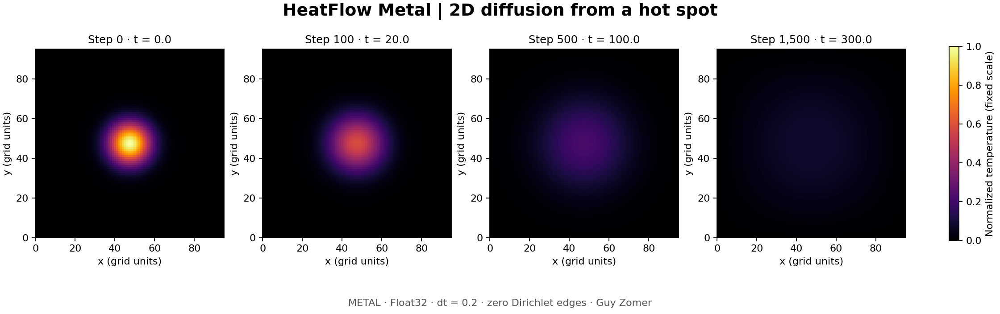

# HeatFlow Metal

**A 2D heat diffusion simulator with a Swift CPU reference, a native Metal GPU backend, and reproducible performance measurements.**

[](https://github.com/guyzom/heatflow-metal/actions/workflows/ci.yml)



This project demonstrates numerical methods, GPU compute, correctness testing, and honest performance analysis in a small codebase. The GPU uses one thread per grid node and two alternating buffers. The CPU implements the same explicit five-point stencil in Float32. Both keep the outer nodes fixed at their initial values.

## Quick start

On a Mac with macOS 14+, a Metal GPU, and Swift 6.0+ from a full Xcode installation:

```sh
swift test --disable-xctest -c release
swift build -c release
.build/release/heatflow info
.build/release/heatflow demo --backend metal --output output/demo
.build/release/heatflow benchmark --output output/benchmark.json
```

Tests use Swift Testing; XCTest is not required, and the simulation has no package dependencies. With standalone Xcode Command Line Tools, use `./scripts/swift.sh test -c release` and `./scripts/swift.sh build -c release`. The wrapper locates the Testing framework and macro plugin when present and keeps compiler/package caches inside the checkout. It selects native SwiftPM and disables its subprocess sandbox for local compilation. Native build mode is deprecated in newer SwiftPM versions; see [development](docs/DEVELOPMENT.md) for toolchain compatibility and verification commands.

For a CPU-only run:

```sh
.build/release/heatflow demo --backend cpu --size 96 --steps 1500 --output output/cpu-demo
```

Conditional imports allow the CPU library and CLI to build without Metal. Recorded device verification and performance measurements use macOS. `demo --backend metal` and `benchmark` fail explicitly when no GPU is accessible. They never time the CPU under a GPU label.

To render the optional figure (Python 3.10+):

```sh
python3 -m venv .venv
.venv/bin/pip install -r requirements-demo.txt
.venv/bin/python scripts/render_demo.py output/demo
```

The checked-in figure was rendered from checked-in solver CSV data. Python is only needed for visualization, not solving, tests, or benchmarks.

## The physics

The simulator solves `∂u/∂t = α(∂²u/∂x² + ∂²u/∂y²)` on a rectangular nodal grid. Define `rx = α dt / dx²`, `ry = α dt / dy²`. Each interior node advances by:

```text
u_new[x,y] = u[x,y]
           + rx * (u[x-1,y] - 2*u[x,y] + u[x+1,y])
           + ry * (u[x,y-1] - 2*u[x,y] + u[x,y+1])
```

The explicit Euler / centered-space method requires **`rx + ry ≤ 1/2`**. Configuration construction rejects unstable, non-finite, non-positive, or unrepresentable inputs. For equal spacing, `dt ≤ dx²/(4α)`. Stability does not guarantee a sufficiently accurate solution: refine space and time and check convergence for your use case.

Solver inputs must match the grid and contain only finite Float32 values. For one or more steps, magnitudes are limited to `Float.greatestFiniteMagnitude / 8` to leave headroom for intermediate stencil operations. A zero-step solve accepts any finite field and returns it unchanged.

Boundary condition: **time-independent Dirichlet values taken from the initial outer row/column nodes**. Corners are preserved. The demo uses zero-temperature edges, so heat leaves the domain; total heat is not conserved. Units are arbitrary but must be consistent. The CLI uses `dx = dy = α = 1`, `dt = 0.2`. The library supports different spacings, diffusivity and timestep.

## Verification

`Tests/HeatFlowTests` covers a hand-calculated anisotropic step, input/stability rejection, unchanged boundary values, zero steps, constant fields, the discrete maximum principle, an exact discrete sine eigenmode, second-order mesh convergence against the continuous analytical solution, cooling/symmetry, and split-step consistency.

Metal checks compare every node to the CPU across odd rectangular grids, minimum-size grids, nonzero boundaries, odd/even step counts, and command-batch transitions. They also check determinism and the limiting stable timestep. Metal compilation/execution errors fail tests; only an inaccessible GPU can cause explicit skips. On a machine expected to have a GPU, make skips failures:

```sh
HEATFLOW_REQUIRE_METAL=1 swift test --disable-xctest -c release
```

Float32 arithmetic can differ slightly across processors; parity uses a maximum absolute tolerance of `2e-5` for normalized fields. Independent analytical tests protect against both implementations sharing the same mistake. See [numerics](docs/NUMERICS.md) for derivation and limits.

The correctness workflow runs debug and release tests on macOS, builds the release CLI, checks its error handling, and verifies the recorded benchmark calculations and demo data. Metal tests run when the hosted runner exposes a device; skipped device tests do not establish GPU correctness. The checked-in Metal execution evidence and benchmark samples are from the recorded M1 Pro run, rather than a new hosted performance measurement.

## Architecture and results

| Component | Responsibility |
|---|---|
| `Model.swift` | Validated grid, physical coefficients, fields, shared solver interface |
| `CPU.swift` | Single-threaded row-major reference with two Float32 arrays |
| `Metal.swift` | Runtime shader compilation, GPU buffers, serial encoders, batched submission, synchronization |
| `Shaders/heat.metal` | Five-point stencil and fixed boundaries |
| `HeatFlowCLI/main.swift` | Hardware info, CSV demo, repeated verified JSON benchmarks |
| `scripts/render_demo.py` | Four snapshots on a common temperature scale |

See [performance](docs/PERFORMANCE.md) for the measured results, raw samples, timing scope, and interpretation. `CPU / Metal` wall-time ratios below 1 mean the GPU is slower. GPU command-buffer intervals are separate diagnostics, not the basis for advertised speedups. The reference is single-threaded; it is not an optimized multicore or SIMD baseline.

Metal is the appropriate native backend on Apple Silicon. **CUDA is not implemented and does not run on this Apple GPU.** A future NVIDIA backend should implement the same `HeatSolver` contract via a C/C++ CUDA bridge, preserve stability/boundary behavior, pass the analytical and parity cases, and include host/device transfers and synchronization in its timing. See [architecture](docs/ARCHITECTURE.md) and [development](docs/DEVELOPMENT.md).

## Scope

This is an educational portfolio project, not an industrial PDE package. It does not include adaptive meshes, sources, variable diffusivity, Neumann boundaries, an implicit solver, distributed execution, or a graphical application. It stores two full grids and synchronously returns the final field. Benchmarks depend on power state, background work, thermals, compiler and hardware. Reproduce the raw data on your machine before drawing broader conclusions.

MIT licensed. GitHub repository: [guyzom/heatflow-metal](https://github.com/guyzom/heatflow-metal).
